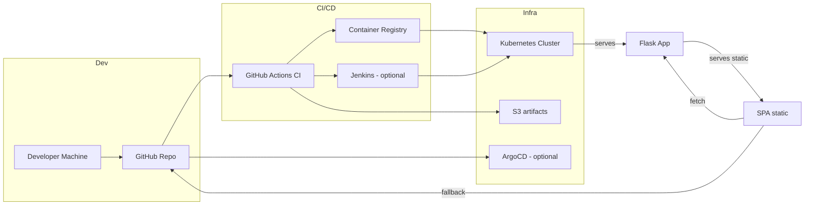

# GitHub Profile Metrics — Demo

This repository contains a small Flask-based demo that aggregates public GitHub
profile metrics (followers, stars, repos, languages) and exposes a single-page
dashboard. It's built and organized with DevOps best practices in mind so you
can extend it and deploy using Docker, CI/CD, Helm, and Terraform (examples
already included in the repo structure).

Key files
- `app/src/app.py` — Flask backend (API + static server)
- `app/src/static/` — Single-page dashboard (HTML/CSS/JS)
- `app/Dockerfile` — Container image for the app
- `.github/workflows/ci.yml` — CI workflow: install deps, run tests, build image

Quick start (local)
1. Build and run with Docker:

```powershell
docker build -t gh-profile-demo -f app/Dockerfile app; 
docker run -p 5000:5000 gh-profile-demo
```

2. Open http://localhost:5000 and enter a GitHub username.

Notes for production
- Provide `GITHUB_TOKEN` as an environment variable to increase GitHub API
  rate limits in CI or heavy usage. Example: `-e GITHUB_TOKEN=ghp_xxx`.
- Swap the in-memory cache for Redis or memcached for horizontal scaling.
- The `helm/` and `terraform/` folders contain starting points to deploy to
  Kubernetes and AWS respectively; adapt them to your environment.

DevOps and CI
- The included GitHub Actions workflow runs unit tests and builds a Docker
  image. Extend it to push images to your registry or run additional checks.

Infrastructure & CD (how the pieces fit together)

- Terraform (`terraform/`) contains example AWS resources: VPC, subnet, S3
  artifacts bucket and an EC2 bootstrap for Jenkins. Use `terraform plan` and
  `terraform apply` to provision the demo environment. The variables file sets
  `Owner = "Federico Rormoser"` by default.

- Jenkins (`jenkins/Jenkinsfile`) demonstrates a CD pipeline that builds and
  pushes an image to ECR and deploys to Kubernetes. The pipeline also contains
  an optional Helm deploy block (commented) which is the recommended, more
  declarative deployment path.

- Helm chart (`helm/myapp`) packages the application for Kubernetes. The
  `values.yaml` is configured to use `ghcr.io/frormoser/cloud-cicd-platform` by
  default; override in CI with `--set image.repository=... --set image.tag=...`.

- Ansible (`ansible/`) contains small demo playbooks to provision Jenkins and
  to install kubectl/helm on runner hosts. Use these to prepare build agents or
  bastions that operate the cluster.

- ArgoCD manifests (`argo/`) are provided as an optional GitOps reference. The
  `application.yaml` points to `helm/myapp` in this repository and can be used
  by ArgoCD to auto-sync the application into a cluster.

If you want, I can next wire GitHub Actions to publish to GHCR and invoke
Helm to deploy to a cluster (you'll need to provide registry credentials and
kubeconfig as repository secrets). This will complete an end-to-end CI/CD
demo flow.

License
MIT — demo code

---

Deploying the static demo to Netlify (quick demo for interviewers)

1. Netlify serves static sites. This project includes a static SPA under
   `app/src/static/`. The SPA has a fallback to call GitHub public API
   directly if the backend `/api` is not available (suitable for demos).

2. To deploy the static SPA to Netlify:

   - Create a new site on Netlify pointing to this GitHub repository.
   - Set the build command to: `echo "no build"` (the site is static) or leave empty.
   - Set the publish directory to: `app/src/static`

   The Netlify site will serve the SPA. For full functionality (authenticated
   GitHub API, higher rate limits), run the Flask backend on a server and
   configure the SPA to call the backend API (CORS is allowed by the demo).

Architecture overview (concise, English)

- Frontend (SPA): `app/src/static/` — Single-page dashboard that fetches
  profile metrics. Designed to run either with the backend (preferred) or as
  a static demo on Netlify using GitHub public API fallback.

- Backend (API + static server): `app/src/app.py` — Flask app that aggregates
  GitHub public metrics with token support and an in-memory TTL cache. It
  serves the SPA for convenience and aids in rate-limited scenarios.

- Containerization: `app/Dockerfile` — Produces a production-like container
  image. Docker image used by CI and CD pipelines.

- CI: `.github/workflows/ci.yml` — Runs tests and builds an image. Extend to
  publish images to GHCR or ECR and trigger deployments.

- CD options:
  - Jenkins (`jenkins/Jenkinsfile`) — Demonstrates a traditional build/push/deploy flow to ECR + EKS.
  - Helm (`helm/myapp`) — Chart for Kubernetes deployment; used by Jenkins or Argo.
  - ArgoCD (`argo/`) — Optional GitOps manifests to automate sync from repo to cluster.

- Infra: `terraform/` — Example AWS resources (VPC, S3, EC2 for Jenkins).

Planned / Future improvements (explicitly documented)

- Replace in-memory cache with Redis and add Helm values for Redis installation.
- Add GitHub API mocking in tests to make CI fully offline-friendly.
- Add a GitHub Actions job to build -> push to GHCR -> deploy with Helm to a dev cluster.
- Add automated E2E smoke tests (Playwright) and vulnerability scanning in CI.

If you want, I will implement the Netlify deployment config and the GHCR
publishing step next so the repository is fully push-ready with a live demo
URL in the README.

Notes about avatar fallback and repo ordering

- Avatar fallback: If a GitHub profile does not expose an avatar or it's
  missing for some reason, the backend provides a sensible default avatar so
  the UI never breaks (this prevents empty images in the demo).

- Repo ordering: Repositories are sorted by most recent `pushed_at` (newest
  first) so the UI highlights the candidate's most recent work. Language
  labels are normalized and unknown values are shown as `Unknown`.


Contact & Ownership

Federico Rormoser © 2025 — demo project. Contact: https://www.linkedin.com/in/federico-rormoser/ • https://github.com/frormoser/

---

Descripción corta (Español)

Esta aplicación demo muestra métricas públicas de un perfil de GitHub de forma profesional y lista para entrevistas. Permite ingresar cualquier nombre de usuario público y ver: seguidores, repositorios públicos, estrellas totales, lenguajes usados y los repositorios más recientes. El proyecto está pensado como ejemplo de buenas prácticas de DevOps: incluye Docker, ejemplos de CI/CD (GitHub Actions y Jenkins), Helm y Terraform como punto de partida.


Cómo probar localmente (rápido)

1. Construir y ejecutar con Docker (PowerShell):

```powershell
docker build -t gh-profile-demo -f app/Dockerfile app; 
docker run -p 5000:5000 gh-profile-demo
```

2. Abrir http://localhost:5000 y escribir un usuario público de GitHub.

Checklist para push (listo para entrevista)

1. Asegúrate de tener todo commiteado:

```powershell
git add .; git commit -m "chore(demo): finalize UI, Netlify fallback, DevOps manifests, README"; git push origin main
```

2. (Opcional) Conectar el repositorio a Netlify y establecer el directorio de publicación a `app/src/static`.

3. Compartir la URL con entrevistadores. Ellos pueden escribir un nombre de usuario público y ver las métricas.

Architecture diagram (Mermaid)



Quick push checklist (ready for interview/demo)

1. Verify tests: `python -m pytest -q app/tests`
2. Commit all changes and push to GitHub:

```bash
git add .
git commit -m "chore(demo): finalize UI, Netlify fallback, DevOps manifests, README"
git push origin main
```

3. (Optional) Connect the repository to Netlify and set publish directory to `app/src/static`.

4. Share the Netlify URL with interviewers. They can enter a public GitHub username and see metrics.

Future work
- Full CI pipeline to publish the Docker image to GHCR and deploy to a dev cluster.
- Replace demo in-memory cache with Redis for production readiness.

