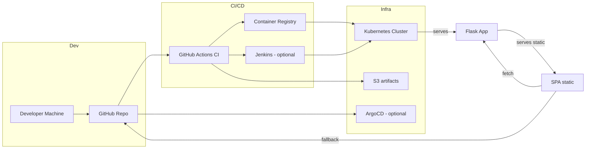

# GitHub Profile Metrics — Demo

This repository contains a small Flask-based demo that aggregates public GitHub
profile metrics (followers, stars, repos, languages) and exposes a single-page
dashboard. It's built and organized with DevOps best practices in mind so you
can extend it and deploy using Docker, CI/CD, Helm, and Terraform (examples
already included in the repo structure).

Key files
- `app/src/app.py` — Flask backend (API + static server)
- `app/src/static/` — Single-page dashboard (HTML/CSS/JS)
- `app/Dockerfile` — Container image for the app
- `.github/workflows/ci.yml` — CI workflow: install deps, run tests, build image


Architecture diagram (Mermaid)


🏗️ Project Structure
```
cloud-cicd-platform/
├── README.md                # Main documentation
├── ansible/                 # Automation playbooks
│   ├── inventory.ini        # Host inventory
│   ├── jenkins.yml          # Provisions Jenkins
│   └── kubernetes.yml       # Installs kubectl/helm on build agents
├── app/                     # Core application
│   ├── Dockerfile           # Container image definition
│   ├── requirements.txt     # Python dependencies
│   ├── src/
│   │   ├── app.py           # Flask backend (API + static server)
│   │   └── static/          # Frontend SPA
│   │       ├── index.html   # UI entry point
│   │       ├── app.js       # SPA logic
│   │       └── styles.css   # Styling
│   └── tests/
│       └── test_app.py      # Unit tests
├── argo/                    # GitOps manifests
│   ├── application.yaml     # ArgoCD application definition
│   └── project.yaml         # ArgoCD project configuration
├── helm/                    # Helm chart for Kubernetes
│   └── myapp/
│       ├── Chart.yaml       # Chart metadata
│       ├── values.yaml      # Default configuration values
│       └── templates/       # Kubernetes manifests (parametrized)
│           ├── deployment.yaml
│           ├── service.yaml
│           ├── ingress.yaml
│           ├── role.yaml
│           ├── rolebinding.yaml
│           └── serviceaccount.yaml
├── jenkins/
│   └── Jenkinsfile          # Jenkins pipeline (build, push, deploy)
└── terraform/               # Infrastructure as Code (AWS)
    ├── main.tf              # Root configuration
    ├── vpc.tf               # Networking (VPC, subnets)
    ├── eks.tf               # EKS cluster
    ├── ec2_jenkins.tf       # EC2 instance for Jenkins
    ├── documentdb.tf        # Example DocumentDB resource
    ├── s3.tf                # S3 bucket for artifacts
    ├── variables.tf         # Input variables
    ├── outputs.tf           # Outputs for reference
    ├── versions.tf          # Required provider versions
    └── tfplan               # Example Terraform plan
```    
Quick start (local)
1. Build and run with Docker:

```powershell
docker build -t gh-profile-demo -f app/Dockerfile app; 
docker run -p 5000:5000 gh-profile-demo
```

2. Open http://localhost:5000 and enter a GitHub username.

Notes for production
- Provide `GITHUB_TOKEN` as an environment variable to increase GitHub API
  rate limits in CI or heavy usage. Example: `-e GITHUB_TOKEN=ghp_xxx`.
- Swap the in-memory cache for Redis or memcached for horizontal scaling.
- The `helm/` and `terraform/` folders contain starting points to deploy to
  Kubernetes and AWS respectively; adapt them to your environment.

DevOps and CI
- The included GitHub Actions workflow runs unit tests and builds a Docker
  image. Extend it to push images to your registry or run additional checks.

Infrastructure & CD (how the pieces fit together)

- Terraform (`terraform/`) contains example AWS resources: VPC, subnet, S3
  artifacts bucket and an EC2 bootstrap for Jenkins. Use `terraform plan` and
  `terraform apply` to provision the demo environment. The variables file sets
  `Owner = "Federico Rormoser"` by default.

- Jenkins (`jenkins/Jenkinsfile`) demonstrates a CD pipeline that builds and
  pushes an image to ECR and deploys to Kubernetes. The pipeline also contains
  an optional Helm deploy block (commented) which is the recommended, more
  declarative deployment path.

- Helm chart (`helm/myapp`) packages the application for Kubernetes. The
  `values.yaml` is configured to use `ghcr.io/frormoser/cloud-cicd-platform` by
  default; override in CI with `--set image.repository=... --set image.tag=...`.

- Ansible (`ansible/`) contains small demo playbooks to provision Jenkins and
  to install kubectl/helm on runner hosts. Use these to prepare build agents or
  bastions that operate the cluster.

- ArgoCD manifests (`argo/`) are provided as an optional GitOps reference. The
  `application.yaml` points to `helm/myapp` in this repository and can be used
  by ArgoCD to auto-sync the application into a cluster.


Architecture overview 

- Frontend (SPA): `app/src/static/` — Single-page dashboard that fetches
  profile metrics. Designed to run either with the backend (preferred) or as
  a static demo on Netlify using GitHub public API fallback.

- Backend (API + static server): `app/src/app.py` — Flask app that aggregates
  GitHub public metrics with token support and an in-memory TTL cache. It
  serves the SPA for convenience and aids in rate-limited scenarios.

- Containerization: `app/Dockerfile` — Produces a production-like container
  image. Docker image used by CI and CD pipelines.

- CI: `.github/workflows/ci.yml` — Runs tests and builds an image. Extend to
  publish images to GHCR or ECR and trigger deployments.

- CD options:
  - Jenkins (`jenkins/Jenkinsfile`) — Demonstrates a traditional build/push/deploy flow to ECR + EKS.
  - Helm (`helm/myapp`) — Chart for Kubernetes deployment; used by Jenkins or Argo.
  - ArgoCD (`argo/`) — Optional GitOps manifests to automate sync from repo to cluster.

- Infra: `terraform/` — Example AWS resources (VPC, S3, EC2 for Jenkins).

Planned / Future improvements (explicitly documented)

- Replace in-memory cache with Redis and add Helm values for Redis installation.
- Add GitHub API mocking in tests to make CI fully offline-friendly.
- Add a GitHub Actions job to build -> push to GHCR -> deploy with Helm to a dev cluster.
- Add automated E2E smoke tests (Playwright) and vulnerability scanning in CI.


# 📫 Contact  
## 👨‍💻 Federico Rormoser © 2025 
<p align="center">
  <a href="mailto:joelrormoser@gmail.com">
    
  </a>
  <a href="https://www.linkedin.com/in/federico-rormoser/">
    
  </a>
  <a href="https://github.com/frormoser">
    
  </a>
</p>  
